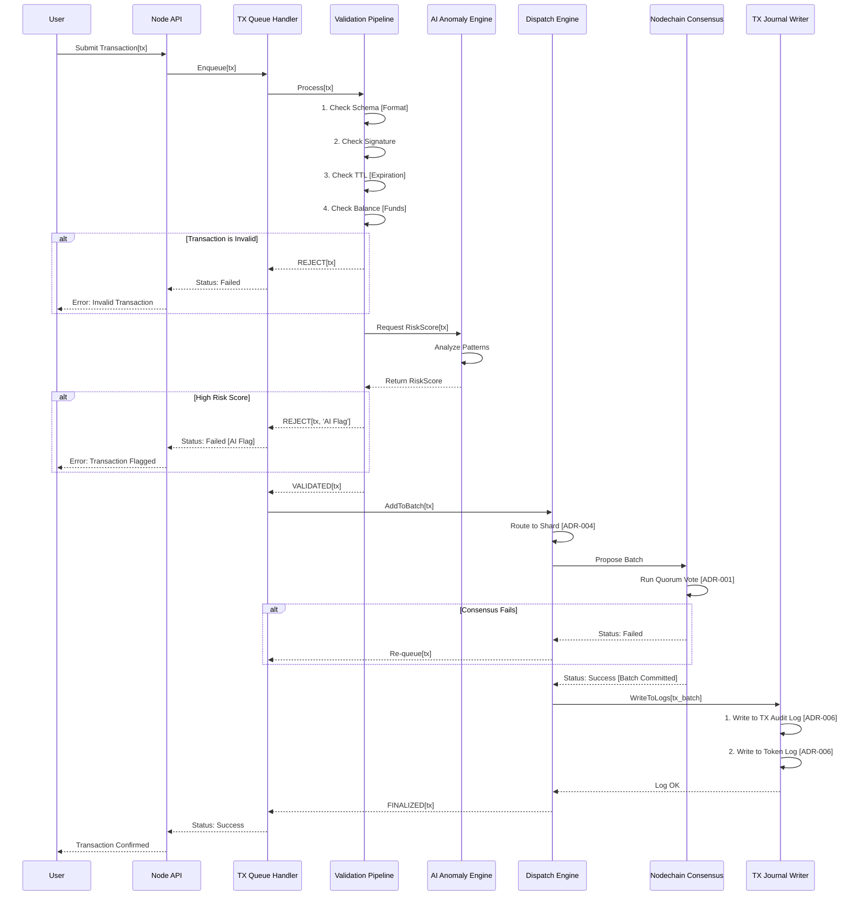

# AST Platform: Sequence Diagrams

This document provides visual sequence diagrams for the most critical processes within the AST "Swiss Watch" architecture. These diagrams are generated using Mermaid code and illustrate the flow of logic between different system modules.

---

## 1. Standard Transaction Lifecycle (Module 07)

This diagram shows the complete lifecycle of a standard user transaction, from submission to finalization and audit.

**Source Files:**

* `07_processing_layer/tx_queue_handler.md`
* `07_processing_layer/tx_validation_pipeline.md`
* `12_nodechain_ai_agents/anomaly_detection_engine.md`
* `07_processing_layer/tx_dispatch_engine.md`
* `07_processing_layer/tx_journal_writer.md`
* `02_nodechain_engine/network_consensus_model.md`



## 2. Fiat-to-AST Tokenization Lifecycle (Module 05)

This diagram shows the critical path for a user to convert fiat currency into a digital asset (e.g., AFC) on the platform. This flow highlights the **mandatory KYC/AML checkpoint**.

**Source Files:**

* `05_bridge_layer/kyc_aml_interface_bridge.md`
* `05_bridge_layer/tokenization_bridge_architecture.md`
* `docs/requirements/schemas/bridge_request.schema.json`

```mermaid
sequenceDiagram
    participant User
    participant KYC_Provider as 3rd-Party KYC Provider [Off-Chain]
    participant Mod_05_ALB as Aros Logic Bridge [ALB]
    participant Mod_05_Oracle as Compliance Oracle [On-Chain]
    participant Mod_05_Bridge as Tokenization Bridge [On-Chain]
    participant Mod_03_Token as Token Mgmt Layer [On-Chain]

    Note over User, KYC_Provider: Phase 1: Off-Chain Identity Verification
    User->>KYC_Provider: Submit Identity Documents [Passport, etc.]
    KYC_Provider->>KYC_Provider: 1. Verify Documents
    KYC_Provider->>KYC_Provider: 2. Run AML/Sanctions Check
    KYC_Provider-->>User: Identity Verified

    Note over User, Mod_05_Bridge: Phase 2: On-Chain Tokenization Request
    User->>Mod_05_ALB: 1. Initiate Tokenization Request [Amount, Fiat TX ID]
    KYC_Provider->>Mod_05_ALB: 2. Send KYC Decision [SIGNED]
    
    Mod_05_ALB->>Mod_05_ALB: 3. Combine Request + KYC Decision
    Mod_05_ALB->>Mod_05_Oracle: 4. Submit bridge_request [Signed by ALB]
    
    Mod_05_Oracle->>Mod_05_Oracle: 1. Verify ALB Signature
    Mod_05_Oracle->>Mod_05_Oracle: 2. Check kycDecision == APPROVED
    Mod_05_Oracle->>Mod_05_Oracle: 3. Check riskScore < threshold
    Mod_05_Oracle->>Mod_05_Oracle: 4. Create Compliance Score
    Mod_05_Oracle-->>Mod_05_ALB: Request Validated
    
    Mod_05_ALB->>Mod_05_Bridge: 5. Call tokenize[user, amount]
    
    Mod_05_Bridge->>Mod_05_Oracle: Check approves[user]
    Mod_05_Oracle-->>Mod_05_Bridge: returns true
    
    Mod_05_Bridge->>Mod_03_Token: Mint[user, amount]
    Mod_03_Token->>Mod_03_Token: 1. Mint new tokens
    Mod_03_Token->>Mod_03_Token: 2. Write to Token Audit Trail [ADR-006]
    Mod_03_Token-->>Mod_05_Bridge: Mint Success
    
    Mod_05_Bridge-->>Mod_05_ALB: Tokenization Complete
    Mod_05_ALB-->>User: Success: Tokens are in your wallet
