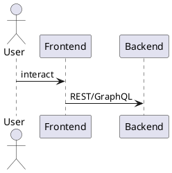
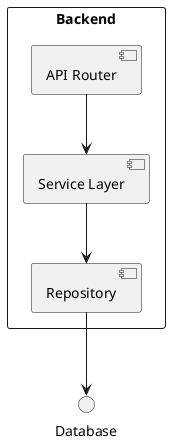
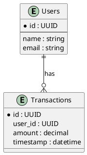

# Development Guide

## Environment Requirements
- Node.js 20+ (see `.nvmrc` for version)
- npm
- Python 3.11+
- Docker and Docker Compose
- Git

## Commands
```bash
npm install        # install dependencies
npm run build      # compile TypeScript
npm start          # run compiled application
npm run dev        # run with hot reload
npm test           # run unit tests
npm run lint       # run ESLint
npm run format     # check Prettier formatting
```

## Project Structure
```
./
├── src/              # application source code
├── tests/            # Jest test suites
├── docs/             # project documentation
├── 01_coin_engine/   # layer docs
└── ...               # additional layers and resources
```

## Architecture Diagrams

### Frontend


### Backend


### Database


## Patterns
- Layered architecture separating API, service, and data access
- Repository pattern for data persistence
- Dependency injection for services
- Async/await for concurrency

## Code Style
- ESLint with `@typescript-eslint` and `import` plugins
- Prettier formatting: semicolons, single quotes, trailing commas, 100 character line width
- EditorConfig: LF line endings, UTF-8, 2-space indentation
- Follow Conventional Commits (`feat:`, `fix:`, `docs:`)
