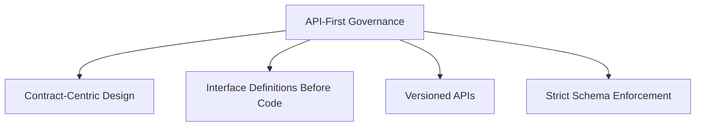
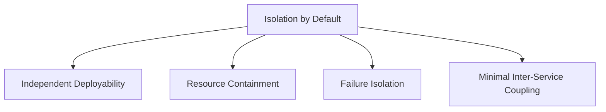
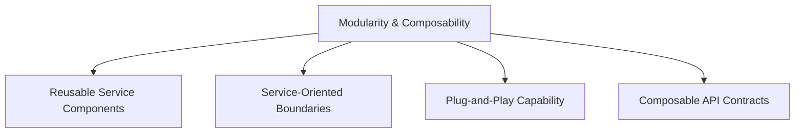
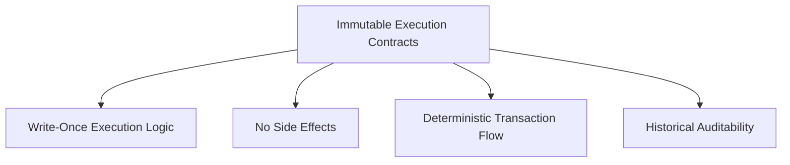

# Principles & Paradigm

**Principles & Paradigm**

The AFC microservice system is built on a set of core architectural principles that define its identity, enforce its rules, and ensure that every component acts as an autonomous yet cooperative participant. These principles are not suggestions — they are structural mandates, enforced both by protocol and AI-based oversight layers.

### **1. API-First Governance**

Each microservice in AFC is designed around an **API-first paradigm**, meaning its contract (the API) is defined before the internal implementation. This ensures:

- **Predictability and interoperability** across services.
- Strict enforcement of **versioning, request schemas, and response formats**.
- Seamless **inter-service negotiation and rollback logic**.

This approach enables a uniform interface policy, minimizes integration friction, and strengthens the trust boundary between isolated logic zones.

---

### **2. Isolation by Default**

Every service is designed to be **logically, operationally, and even legally isolated**. This is enforced by:

- **Stateless service patterns** (unless explicitly needed).
- **Dedicated storage layers** with no shared data persistence.
- **Contextual identity segregation** (i.e., crypto vs. fiat, compliance zones, AI agents).

Isolation allows rollback without system-wide impact, localized fault recovery, and dynamic substitution of services at runtime.

---

### **3. Modularity & Composability**

Modularity means each microservice **performs a single, well-bounded function**, but the **system as a whole is composable** — capable of building emergent workflows through orchestrated service chains.

This allows:

- Plug-and-play service updates without halting the system.
- Deployment across **multi-jurisdictional clusters**.
- Regulatory sandboxing: services can be selectively disabled or replicated per compliance domain.

---

### **4. Immutable Execution Contracts**

Each microservice operates under an **immutable execution contract** — a declared behavior and output signature that must be fulfilled regardless of state, origin, or external dependencies. These contracts are registered at the Control Layer and validated via Lac Musa’s Correction Protocol.

---