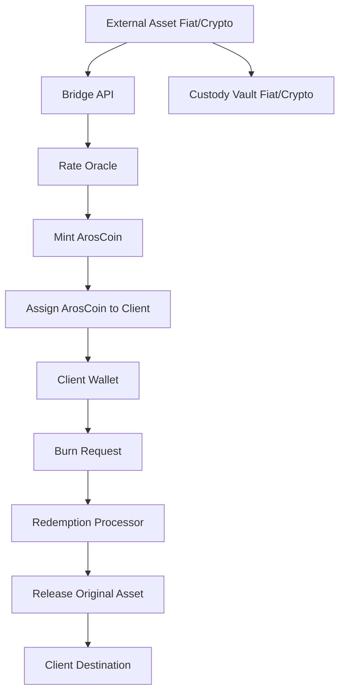
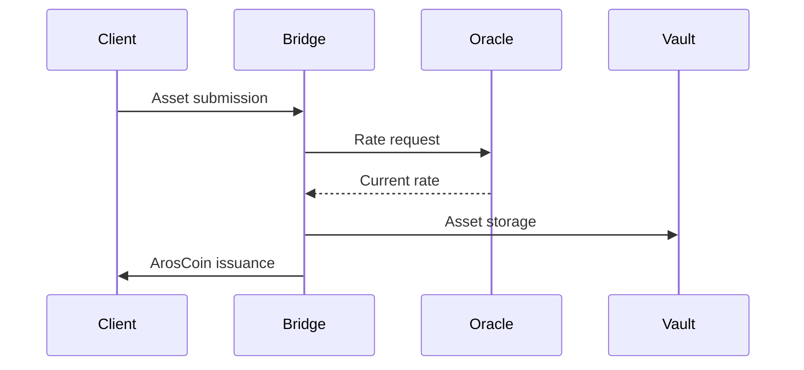
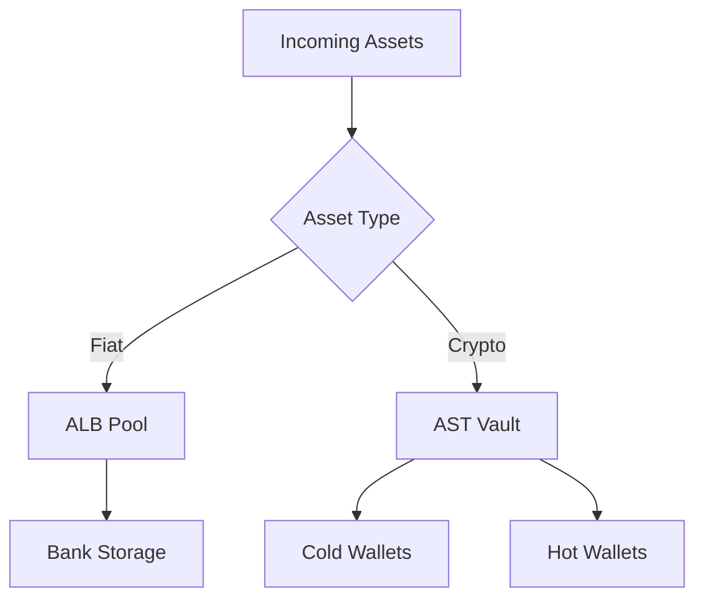
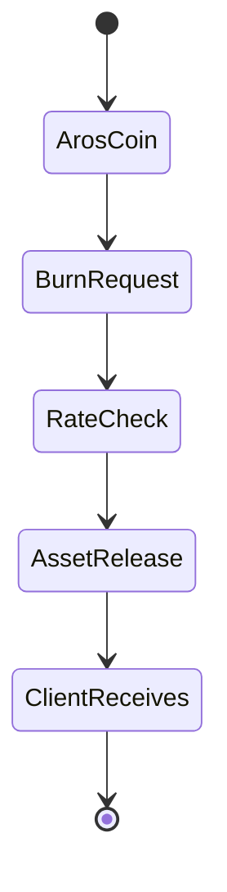

# ArosCoin Conversion and Custodial Logic – Official AFC Model for Asset-Backed Tokenization

Created: June 1, 2025 4:03 AM

# **ArosCoin Conversion and Custodial Logic – Official AFC Model for Asset-Backed Tokenization**

### **✅ Purpose:**

To ensure **asset-backed issuance** of ArosCoin while maintaining **full custody**, **risk insulation**, and **economic integrity** for both the system and external participants (banks, institutions, users), regardless of market volatility.

---

### **🧩 Process Overview:**

### **1.**

### **Incoming Transaction (Fiat or Crypto → ArosCoin)**

- **Any asset**, whether fiat or crypto (e.g., BTC, ETH, USDT, USD, EUR), when sent into the system, is **not directly converted into another currency**.
- Instead, it is **locked into a designated liquidity pool** (ALB for fiat, AST for crypto), and **ArosCoin is issued** as a 1:1 representation of that value at the moment of entry.

### **2.**

### **Issuance Mechanics**

- The **Bridge API** checks the real-time exchange rate via the **Rate Oracle**.
- Based on the current rate (e.g., 1 BTC = $110,000), the system mints **ArosCoin** reflecting this value.
- If 1 BTC is sent → 110,000 ArosCoin are minted and assigned to the client.
- The BTC is then stored in the **AST Custodial Vault** and marked as “reserved backing” for that issuance.

---

### **🔐 Custodial Principles**

### **The received crypto assets are**

### **not liquidated**

### **.**

They are **held under cold/hot wallet strategies** depending on system policy and stored until redemption or withdrawal is requested.

### **The ArosCoin does**

### **not simulate value**

### **– it is**

### **directly linked to real assets**

### **in system custody.**

### **Each ArosCoin is**

### **fully backed**

### **, either by:**

- Fiat in ALB-reserve pool (regulated bank storage),
- Crypto in AST-vault pool (self-custodied digital wallets with proof-of-funds),
- Or hybridized forms for institutional-level swaps.

---

### **🔄 Redemption or Exit Logic**

### **3.**

### **Client requests withdrawal or swap (ArosCoin → Fiat/Crypto)**

- The client sends ArosCoin back to the system (burn request).
- Based on the current exchange rate, the system calculates how much fiat/crypto to return.
- ArosCoin is burned → the previously locked asset is released.

---

### **📈 Market Movement Scenarios**

### **Scenario A – Market Rises:**

- Client sends in 1 BTC @ $110k → receives 110,000 ArosCoin.
- BTC now worth $150k.
- Client redeems 110,000 ArosCoin.
- System returns 1 BTC, worth $150k.
- **System incurred no loss**, because BTC was never sold — it was **held**.

✔ **System gains market delta** if client doesn’t redeem (unrealized gain).

✔ **System is neutral** if client redeems 1:1.

✔ No “top-up” required, because custody was maintained.

---

### **Scenario B – Market Falls:**

- Client sends 1 BTC @ $110k → 110,000 ArosCoin minted.
- BTC drops to $90k.
- If client redeems: they get 1 BTC (now worth $90k).
- System suffers **no fiat loss**, as BTC is simply returned.

✔ If system allows fiat redemption (instead of BTC), client will receive fiat **based on current market**, unless **insurance pool** or buffer policy is triggered.

---

### **💡 Conversion Guarantee Model**

1. **Fixed-At-Entry Logic**:
    - ArosCoin issuance is always based on the **price at the moment of deposit**, not retroactively adjusted.
2. **Custodial Integrity**:
    - All incoming assets remain **intact, untouched, and allocated**.
3. **Redeemability**:
    - ArosCoin can always be redeemed either:
        - In original asset (BTC, ETH, USDT), or
        - In system-defined equivalent based on live market value (via Bridge Oracle).

---

### **⚖️ Protection Mechanisms**

| **Feature** | **Purpose** |
| --- | --- |
| **Custodial Vault** | Ensures backing and security of assets |
| **Real-Time Rate Oracle** | Ensures fair and exact conversion |
| **Locked Liquidity Pools** | Guarantees 1:1 availability |
| **Audit Trail** | Transparent linkage between deposit → issuance → redemption |
| **Rollback Support** | For time-limited rollback of faulty or mispriced transactions |
| **Governance Layer** | AI-supervised risk engine validates exposures and caps |

---

### **📊 Diagram – ArosCoin Custody & Conversion Flow (Mermaid)**

---

### **🏁 Conclusion**

The ArosCoin economy is **fully asset-backed**, **custodially secure**, and **market-insulated**, thanks to:

- Smart issuance
- Vaulted reserve pools
- Deterministic burning logic
- Zero over-issuance
- Zero leverage or algorithmic simulation

This model ensures that **regulators**, **banks**, **crypto clients**, and **institutional partners** can all trust the **integrity, solvency, and reversibility** of the ArosCoin system — regardless of volatility or asset type.

Here are the diagrams translated to English with their accompanying text:

Based on this document, I can suggest several additional Mermaid diagrams to visualize different aspects of the ArosCoin system:

Here's another diagram showing the asset storage structure:

And a diagram of the redemption process:

These diagrams complement the existing documentation and help visualize various aspects of the system, including the conversion process, storage principles, and redemption mechanism.

---