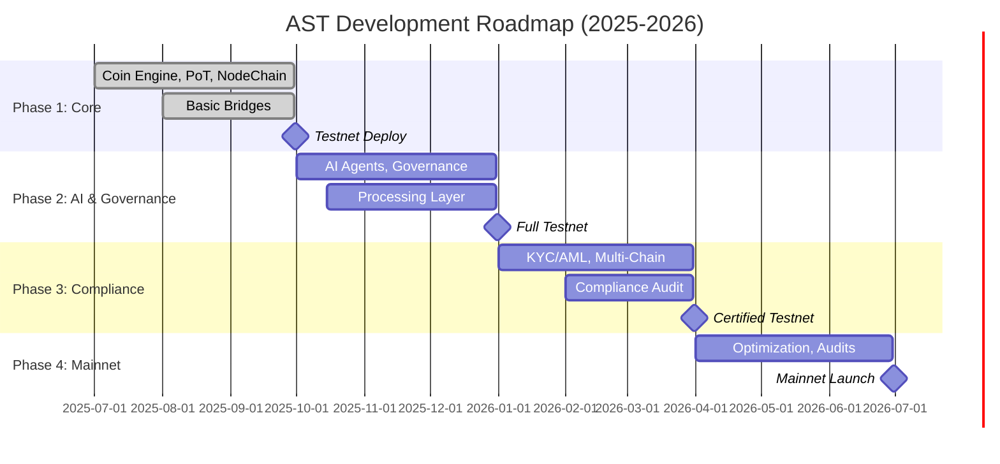

# AST Project Roadmap

This document outlines the development and deployment roadmap for the AROS Studio Tokenomics (AST) system, detailing phases, milestones, timelines, and dependencies for building a production-ready, AI-governed, utility-driven tokenomics platform. The roadmap spans from Q3 2025 to Q2 2026, covering core infrastructure, AI integration, compliance, and multi-chain expansion. It includes stylistic timelines, estimated durations, and resource considerations, ensuring alignment with AST's principles of security, transparency, and non-speculative tokenomics. Last updated: 2025-08-17.

## 1. Purpose
The roadmap serves to:
- Define clear, time-bound phases for AST development and deployment.
- Outline key deliverables, including documentation, code, and infrastructure.
- Identify dependencies and critical paths across layers (Coin Engine, Bridges, PoT, etc.).
- Provide governance and stakeholders with a schedule for resource allocation.
- Ensure compliance with regulatory requirements (e.g., MiCA, SEC) and audit readiness.

## 2. Scope
Covers all AST components:
- **Core Layers**: Coin Engine, NodeChain, Token Management, Value Circulation, Bridges, Governance, Processing, Emission, Crypto Ingestion, PoT, Validator Staking, AI Agents, The All-Seeing Eye, Decentralized TX Encoding.
- **Infrastructure**: Smart contracts (Solidity), backend services (Python/FastAPI), databases (PostgreSQL/Redis), and monitoring (All-Seeing Eye).
- **Deployment**: Testnet (Sepolia) and mainnet (Ethereum-compatible).
- **Compliance**: KYC/AML integration, regulatory audits.

## 3. Timeline Overview
The roadmap is divided into four phases, each with specific goals, deliverables, and durations. Timelines are based on a team of ~10 developers (Solidity, Python, DevOps), with external audit support. Each phase includes a buffer for delays and governance reviews.

| Phase | Timeline | Duration | Focus |
|-------|----------|----------|-------|
| Phase 1: Core Infrastructure | Q3 2025 (Jul-Sep) | 3 months | Coin Engine, PoT, NodeChain, basic bridges |
| Phase 2: AI & Governance | Q4 2025 (Oct-Dec) | 3 months | AI agents, governance, processing layer |
| Phase 3: Compliance & Multi-Chain | Q1 2026 (Jan-Mar) | 3 months | KYC/AML, cross-chain bridges, regulatory prep |
| Phase 4: Optimization & Mainnet | Q2 2026 (Apr-Jun) | 3 months | Performance tuning, audits, mainnet launch |

## 4. Detailed Phases

### Phase 1: Core Infrastructure (Q3 2025, Jul-Sep)
**Goal**: Build foundational components for ArosCoin, PoT, and basic connectivity.  
**Duration**: 12 weeks (Jul 1 - Sep 30, 2025).  
**Team**: 4 Solidity devs, 4 Python devs, 2 DevOps.  
**Deliverables**:
- **Coin Engine** (01_coin_engine/):
  - Full implementation of `coin_emission_model.md`, `burn_and_mint_rules.md`, `reward_distribution.md`.
  - Deploy `token_generation_contract.sol` to Sepolia (Week 4).
  - JSON spec: `AROS_Coin_TokenSpec.json` finalized (Week 6).
  - Estimated effort: 3 devs x 8 weeks = 24 person-weeks.
- **NodeChain Engine** (02_nodechain_engine/):
  - Implement `node_registration_and_auth.md`, `transaction_sharding_logic.md`, `encryption_protocol.md`.
  - Python modules: `node_registration.py`, `tx_sharding.py` (Week 8).
  - Estimated effort: 2 devs x 6 weeks = 12 person-weeks.
- **PoT Engine** (10_proof_of_transaction_engine/):
  - Full logic for `pot_tx_validation_logic.md`, `pot_tx_weighting_model.md`, `pot_slashing_conditions.md`.
  - Python: `pot_validation.py`, `pot_weighting.py` (Week 10).
  - Estimated effort: 2 devs x 8 weeks = 16 person-weeks.
- **Basic Bridges** (05_bridge_layer/):
  - Deploy `tokenization_bridge_architecture.md`, `reverse_tokenization_bridge.md`.
  - Python FSM: `reverse_tokenization_fsm.py` (Week 9).
  - Estimated effort: 2 devs x 6 weeks = 12 person-weeks.
- **Testing**: Initial unit tests (pytest for Python, Hardhat for Solidity) for above (Week 10-12).
- **Infrastructure**: Hardhat setup, PostgreSQL/Redis deployed locally (Week 2).

**Dependencies**:
- `glossary.md` finalized for term consistency (Week 1).
- `deployment_guide.md` for testnet setup (Week 3).

**Risks**:
- Delay in Solidity contract audits (mitigated by Slither scans, Week 5).
- NodeChain sharding complexity (buffer: 2 weeks).

**Milestone**: Testnet deployment of Coin Engine and PoT (Sep 30, 2025).

### Phase 2: AI & Governance (Q4 2025, Oct-Dec)
**Goal**: Integrate AI agents, governance, and processing layer for full functionality.  
**Duration**: 12 weeks (Oct 1 - Dec 31, 2025).  
**Team**: 3 Solidity devs, 5 Python devs, 2 DevOps, 1 ML engineer.  
**Deliverables**:
- **AI Agents** (12_nodechain_ai_agents/):
  - Implement `agent_architecture.md`, `anomaly_detection_engine.md`, `meta_learning_feedback_loop.md`.
  - Python: `anomaly_detection_engine.py` with PyTorch for basic ML (Week 6).
  - Estimated effort: 2 devs + 1 ML x 8 weeks = 24 person-weeks.
- **Governance Layer** (06_governance_layer/):
  - Full implementation of `proposal_submission_protocol.md`, `voting_mechanism.md`, `governance_token_logic.md`.
  - Python: `governance_rules.py` for YAML policy loading (Week 8).
  - Estimated effort: 2 devs x 6 weeks = 12 person-weeks.
- **Processing Layer** (07_processing_layer/):
  - Deploy `tx_queue_handler.md`, `tx_dispatch_engine.md`, `tx_journal_writer.md`.
  - FastAPI app: `api/app.py` with endpoints `/tx/enqueue`, `/tx/next` (Week 10).
  - Estimated effort: 3 devs x 8 weeks = 24 person-weeks.
- **The All-Seeing Eye** (13_extra_supervisory_layer/):
  - Implement `anomaly_detection_patterns.md`, `integrity_signal_emission.md`.
  - Python: `integrity_signal.py` for non-blocking signals (Week 9).
  - Estimated effort: 2 devs x 6 weeks = 12 person-weeks.
- **Testing**: Integration tests for AI-governance-processing flows (Week 10-12).
- **Infrastructure**: Redis cluster, Prometheus/Grafana for monitoring (Week 4).

**Dependencies**:
- Phase 1 completion (Coin Engine, PoT).
- `economic_simulation.md` for parameter tuning (Week 2).

**Risks**:
- AI model training delays (mitigated by pre-trained weights, Week 6).
- Governance quorum testing (buffer: 2 weeks).

**Milestone**: Full testnet with AI and governance (Dec 31, 2025).

### Phase 3: Compliance & Multi-Chain (Q1 2026, Jan-Mar)
**Goal**: Add KYC/AML, cross-chain bridges, and regulatory prep.  
**Duration**: 12 weeks (Jan 1 - Mar 31, 2026).  
**Team**: 2 Solidity devs, 4 Python devs, 2 DevOps, 2 compliance specialists.  
**Deliverables**:
- **Bridges** (05_bridge_layer/):
  - Full `kyc_aml_interface_bridge.md`, `multi_network_bridge_logic.md`.
  - Python: `bridge_registry.py` for multi-chain (BTC, ETH, TON) (Week 6).
  - Estimated effort: 2 devs x 8 weeks = 16 person-weeks.
- **Compliance**:
  - Integrate Chainalysis or similar for KYC/AML (Week 4).
  - Document compliance for MiCA/SEC in `threat_model_global.md` (Week 8).
  - Estimated effort: 2 specialists x 6 weeks = 12 person-weeks.
- **Crypto Ingestion** (09_crypto_ingestion_pipeline/):
  - Implement `external_crypto_ingestion.md`, `crypto_tx_normalization.md`.
  - Python: `ingestion_normalize.py` (Week 7).
  - Estimated effort: 2 devs x 6 weeks = 12 person-weeks.
- **Testing**: Cross-chain TX tests, compliance audits (Week 10-12).
- **Infrastructure**: Multi-chain nodes (e.g., BTC full node, ETH RPC) (Week 3).

**Dependencies**:
- Phase 2 completion (AI, governance).
- `glossary.md` updates for compliance terms (Week 1).

**Risks**:
- Regulatory changes post-2025 (mitigated by modular compliance hooks).
- Cross-chain latency (buffer: 2 weeks).

**Milestone**: Compliance-certified testnet with multi-chain support (Mar 31, 2026).

### Phase 4: Optimization & Mainnet (Q2 2026, Apr-Jun)
**Goal**: Optimize performance, complete audits, and launch mainnet.  
**Duration**: 12 weeks (Apr 1 - Jun 30, 2026).  
**Team**: 2 Solidity devs, 3 Python devs, 3 DevOps, 2 auditors.  
**Deliverables**:
- **Optimization**:
  - Gas optimization for contracts (Week 4).
  - Python performance tuning (FastAPI throughput >1,000 TX/sec) (Week 6).
  - Estimated effort: 3 devs x 6 weeks = 18 person-weeks.
- **Audits**:
  - External audit by Certik/Quantstamp (Week 8).
  - Internal Slither scans (Week 2).
  - Estimated effort: 2 auditors x 8 weeks = 16 person-weeks.
- **Mainnet Deployment**:
  - Deploy all contracts to Ethereum mainnet (Week 10).
  - Scale observer nodes on AWS/Kubernetes (Week 9).
  - Estimated effort: 3 DevOps x 8 weeks = 24 person-weeks.
- **Monitoring**: Full Prometheus/Grafana integration with All-Seeing Eye (Week 6).
- **Documentation**: Finalize all .md files, update `CHANGELOG.md` (Week 12).

**Dependencies**:
- Phase 3 completion (compliance, multi-chain).
- `threat_model_global.md` for audit focus (Week 1).

**Risks**:
- Audit findings requiring rewrites (buffer: 2 weeks).
- Mainnet gas costs (mitigated by L2 consideration, Week 4).

**Milestone**: Mainnet launch with full audits (Jun 30, 2026).

## 5. Timeline Diagram

## 6. Resource Estimates
- **Total Effort**: ~1,200 person-weeks (10 devs x 48 weeks).
- **Budget Estimate**: Assuming $100/hr per dev, ~$4.8M (includes audits, infra).
- **Infra Costs**: ~$10k/month for AWS/Kubernetes, $2k/month for oracles.
- **Audit Costs**: $50k per external audit (2 planned).

## 7. Dependencies
- `01_coin_engine/coin_emission_model.md`: Emission logic for Phase 1.
- `05_bridge_layer/kyc_aml_interface_bridge.md`: Compliance for Phase 3.
- `06_governance_layer/governance_token_logic.md`: Voting for Phases 2-4.
- `12_nodechain_ai_agents/anomaly_detection_engine.md`: AI for Phase 2.
- `13_extra_supervisory_layer/the_all_seeing_eye_overview.md`: Monitoring for all phases.
- `economic_simulation.md`: Parameter tuning for all phases.

## 8. Open Questions
- Should L2 (e.g., Optimism) be prioritized for gas savings in Phase 4?
- How to handle regulatory shifts (e.g., MiCA updates) in Q1 2026?
- Can AI agent training be accelerated with external datasets?

## 9. Governance Integration
- Each phase requires a governance proposal (06_governance_layer/proposal_submission_protocol.md).
- Milestones trigger quorum votes for approval (67% threshold).
- Parameter changes (e.g., emission ratios) proposed via `economic_simulation.md` outputs.

This roadmap ensures AST's timely delivery while maintaining security and compliance. For further details, refer to the linked documents or contact AROS Studio at info@arosstudio.com.

